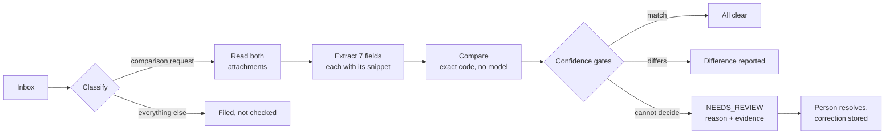

<div align="center">

<picture>
  <source media="(prefers-color-scheme: dark)" srcset="brand/protozero-wordmark-light.svg">
  
</picture>

### Shipping document verification

Reads an inbox, checks each draft Bill of Lading against the Shipping Instruction
it belongs to, and says clearly when it is not sure enough to answer.

[](#results)
[](#results)
[](#results)
[](requirements.txt)
[](web/package.json)
[](api/main.py)

Built by Team Protozero for the Averis&nbsp;x&nbsp;Monash Hackathon 2026.

</div>

---

## The problem

A shipping operations desk receives email all day. Some of it says *"here is the
draft paperwork, please confirm it matches what the customer asked for."*

Two documents are involved:

- **The Shipping Instruction (SI)** — what the customer asked for. The reference.
- **The draft Bill of Lading (BL)** — what the carrier typed up. The thing being checked.

A person opens both and compares seven details by eye: shipper, consignee,
notify party, port of loading, port of discharge, container count and gross
weight. It is slow, and the mistakes are expensive. A wrong consignee is a
container delivered to the wrong company.

## The idea

The obvious approach is to hand both documents to a language model and ask
whether they match. We deliberately do not do that, for two reasons: a model
gives different answers on different days, which cannot be audited, and a
confident wrong "all clear" is the single most costly output this system can
produce.

So the design is a **deterministic comparison engine with AI at the two edges
where determinism runs out**: understanding intent in a messy inbox, and reading
documents a parser cannot.



1. **Classify** every email. Rules first; a model only sees what the rules could
   not match. Only genuine comparison requests continue.
2. **Resolve and read** the two attachments across `.txt`, `.pdf`, `.docx` and
   `.xlsx`. Image-only scans are read by Azure AI Document Intelligence and
   held for a person to confirm.
3. **Extract** the seven fields from each document, every value carrying the
   exact snippet it came from.
4. **Compare** — plain, exact code. The model never decides whether two values
   match.
5. **Score confidence** per field, from whether the evidence was located, whether
   the value parsed, and the quality of the document it came from.
6. **Decide**: all clear, a difference to report, or `NEEDS_REVIEW` with its
   reason and its evidence. Refusing is a first-class outcome, not a failure path.
7. **A person resolves** what was refused, and the correction is stored and reused.

This is orchestration and deterministic document checking, not custom-model
training. Optional AI services only assist when rules or parsers cannot finish;
after repeated service failures a circuit breaker keeps the deterministic path
running and says so in the interface.

## Results

Measured on the 520-email practice set with the organisers' scorer, deterministic
path only, no cloud calls.

| Stage | Metric | Score |
| --- | --- | --- |
| 1 · Classification | accuracy / macro-F1 | **1.000** / **1.000** |
| 3 · BL-vs-SI comparison | defect recall / precision | **1.000** / **1.000** |
| Reliability | escalation recall / precision | **1.000** / **1.000** |
| End to end | defect emails caught | **46 / 46** |
| | **Final score** | **1.0000** |

520 emails in 0.3s, 100% resolved by rules, zero cloud calls, 48 unit tests green.

> [!NOTE]
> This is one draw. The final round is a fresh draw from the same generator, and
> most of the classification score currently rests on literal subject-line
> templates, so the honest number to watch is what the grammar layer catches when
> those templates shift. See [`docs/eval_plan.md`](docs/eval_plan.md).

## Where the AI is

Two Azure services sit at the edges of the pipeline. Neither ever decides
whether two values match.

**Azure OpenAI (`gpt-4.1-mini`) reads intent.** A comparison request that
arrives with no attachments is ambiguous in a way no phrase list survives: the
sender is either asking us to check documents that went missing, or asking us to
issue a draft that doesn't exist yet. The first needs a person to chase the
attachments; the second has nothing to check. The model reads which, and an
unclear or low-confidence answer takes the cautious path and goes to a person.
The same deployment classifies mail from sender domains the allowlist has never
seen, because a new customer on day one looks exactly like an unknown domain,
and binning a real request as spam is the worst mistake this system can make.
Every call is temperature zero, constrained to a strict JSON schema, validated
again with Pydantic, and cached, so the same email always gets the same answer.

**Azure AI Document Intelligence reads scans.** A PDF with no text layer goes to
the `prebuilt-layout` model, and its text runs through the same label scanner as
every digital document, so a scan and a digital file are read by one set of
rules. What the service adds is a measured per-word confidence, which feeds the
confidence score, and bounding boxes, so evidence on a scan is highlighted like
evidence anywhere else. A scanned case still does not close on the strength of
an image read. The comparison runs so the reviewer sees every field side by
side, but the case stays with a person until they confirm it, and any
differences are shown as candidates rather than findings. A truncated or corrupt
file is never sent: there is no image there for OCR to read.

**When a service fails, the pipeline doesn't.** Every call runs through a
circuit breaker. After repeated failures it opens, the interface says the system
is running deterministic-only, and each decision falls back to the rule it
replaced. Neither adapter loads at all without its credentials, so an
unconfigured deployment is a supported mode rather than a stream of errors.

On the sample inbox, the subject rules settle every classification, so the
model's visible work is the intent read on the comparison emails that arrived
without attachments, and Document Intelligence on the three scans.

## The interface

Four focused screens, each with one job.

| Screen | Question it answers |
| --- | --- |
| Worklist | What came in, and what did the system conclude? |
| Analytics | Where is workload building up, and which cases explain it? |
| Review queue | What did it refuse to decide, and can I settle it in one click? |
| Case | What did we read, did it match, and how far do we trust our own reading? |

Every compared field carries one word — `checked`, `unsure` or `not checked` — so
the interface never states a result without also stating how much to trust it.
Colour is never the only signal: each state carries a word and a shape, and the
screens are designed to survive being read in greyscale.

<details>
<summary><b>Worklist and analytics</b> — triage, filtering, periods and export</summary>

<br>

The worklist stays focused on daily triage with a compact operational snapshot.
Detailed analytics and live component health have a dedicated **Analytics** page.
It reports the live inbox-to-outcome flow, workload by email type, outcomes for
genuine document-comparison cases, fields with differences and the primary reasons
for human review. Every chart includes its counts and explains its scope;
selecting a chart row opens the matching cases in the worklist.

Explainable priority labels and priority-first sorting bring blocking cases to the
top. Cases can be assigned, moved from assigned to in progress, and completed
through the existing review decisions; ownership and status changes are retained
in the audit trail.

For day-to-day triage, the worklist separates **Incoming**, **History** and **All
records**, shows a compact added-today/action-needed summary, and provides a
contained expandable filter panel. Results and email types support multiple
selections; date presets, custom date ranges and keyword search can be combined.
The panel opens below the tabs without covering or narrowing the case list.

The worklist has a shared **Worklist period & Excel export** selector and
**Download Excel** action. Reports can cover all cases, any selected calendar
month or year, or the rolling last 30 days. Changing the period updates the
visible worklist, tab totals, filter counts and workbook together. Keyword and
advanced filters refine the screen only; each workbook still contains every case
in the selected period. Each workbook states its reporting scope and includes
separate sheets for summary, cases, comparisons, document evidence, audit events
and the review queue. Unchanged reports are cached for five minutes and
automatically invalidated when case, review, decision or audit data changes.
Period reports use the email received timestamp when available and otherwise the
case's first processing timestamp, which is stated on the Summary sheet.

</details>

<details>
<summary><b>The case screen</b> — evidence, case report and audit trail</summary>

<br>

Each comparison case opens with a compact case report: documents present, issues,
extracted field pairs, human corrections, final result, audit-event count and real
page/line evidence locations. The **Download PDF** action exports that current case
state together with the field comparison and audit trail.

Flagged fields explain the two values, similarity and review status in plain
language. Selecting any field opens the full SI and BL source-text previews side
by side, scrolls both to the located source line and highlights it. An **Open
original** link serves the unmodified stored attachment when the live API is
connected. The audit drawer exposes every event's trace ID, timestamp, actor,
action, previous value, new value and reason.

</details>

<details>
<summary><b>What the case buttons do</b> — every action, and what it does not do</summary>

<br>

Every action first opens a confirmation explaining its effect. Nothing sends an
email or edits an uploaded document automatically.

| Button | Result after confirmation |
| --- | --- |
| **Send to a person** | Adds the case to the **Needs a person** queue, marks its lifecycle `in_review`, and records the handoff in the audit log. |
| **Reject the draft** | Marks the case `resolved`, records that the draft was rejected, and adds the reviewer action to the audit log. |
| **Approve the draft** | Marks the case `resolved` as approved and records the action in the audit log. |
| **Ask for a complete instruction** | Adds a follow-up item to the review queue. It does not contact the sender automatically. |
| **Undo** | Removes the saved decision and any manual review item created by it, then records the undo in the audit log. |

</details>

## Quickstart

Node.js 20+ and Python 3.11 are the only prerequisites.

**1. Start the API** from the repository root:

```bash
pip install -r requirements.txt
python -m uvicorn api.main:app --reload --port 8000
```

**2. Start the frontend** in a second terminal:

```bash
cd web
npm install
VITE_API_BASE=/api npm run dev
```

<details>
<summary>Windows PowerShell</summary>

<br>

```powershell
uv run --with-requirements requirements.txt uvicorn api.main:app --reload --port 8000
```

```powershell
$env:VITE_API_BASE="http://127.0.0.1:8000/api"
cd web
npm.cmd install
npm.cmd run dev -- --host 127.0.0.1 --port 5175
```

</details>

Open <http://localhost:5175>. The dev server proxies `/api` to the backend, so the
live path enables document evidence, ordered audit activity, review retries and
case decisions. Without `VITE_API_BASE` the app runs on the fixtures in
`web/mocks/` and says so in a banner.

**3. Switch on the Azure services** (optional). Set these before starting the API;
without them the pipeline runs deterministic-only, which is a supported mode.
One Azure AI Foundry resource serves both, because Document Intelligence is part
of a multi-service resource — so the endpoint and key are usually the same pair.

```text
AZURE_OPENAI_ENDPOINT              https://<resource>.services.ai.azure.com/
AZURE_OPENAI_API_KEY               (secret)
AZURE_OPENAI_DEPLOYMENT_CLASSIFY   the deployment name, not the model id
AZURE_DOCINTEL_ENDPOINT            https://<resource>.services.ai.azure.com/
AZURE_DOCINTEL_KEY                 (secret)
```

`GET /api/health` reports `"mode": "full"` once both are live, and
`"deterministic_only"` otherwise. `SDOC_ENABLE_LLM=0` and `SDOC_ENABLE_DOCINTEL=0`
force the deterministic path back on without unsetting any credentials.

**Scoring and tests:**

```bash
python -m eval.run_eval --source sdoc-hackathon-bundle --no-llm --out submission.json
pytest -q
cd web && npm run build      # production bundle into web/dist/, served by FastAPI
```

`run_eval` writes a submission; grading it needs the organisers' own scorer, which
is not redistributed in this repository. Unpack their package to
`sdoc-hackathon-docker/` and run `python server/score_cli.py submission.json`.

## Repository layout

| Path | What is in it |
| --- | --- |
| `pipeline/` | classify · extract · normalize · compare · confidence · escalate · report |
| `pipeline/azure_llm.py` | Azure OpenAI adapter: intent and unknown-sender classification |
| `pipeline/azure_docintel.py` | Document Intelligence adapter: scans, per-word confidence, boxes |
| `parsers/` | `.txt`, `.pdf`, `.docx`, `.xlsx` readers and document-type detection |
| `api/` | FastAPI app, serving the API and the built SPA |
| `web/src/` | The React app. `index.css` is the single source for colour, type and components |
| `web/mocks/` | API fixtures built from the real dataset, so the frontend runs before the API exists |
| `web/mockups/` | Static design screens, linking the real stylesheet |
| `eval/` | The accuracy harness |
| `sdoc-hackathon-bundle/` | The participant dataset |

## Documentation

| Document | What it settles |
| --- | --- |
| [`docs/architecture.md`](docs/architecture.md) | System design, and ADR-001 to ADR-008 recording what was chosen and why |
| [`docs/contracts.md`](docs/contracts.md) | Data model and HTTP API. Load-bearing; nothing changes without a changelog entry |
| [`docs/spec/pipeline.md`](docs/spec/pipeline.md) | Stage-by-stage specification of the pipeline |
| [`docs/prd.md`](docs/prd.md) | Scope, users, and an explicit list of what we are *not* building |
| [`docs/dataset_facts.md`](docs/dataset_facts.md) | Measured facts about the dataset, and the traps in it |
| [`docs/design_system.md`](docs/design_system.md) | Colour, type, status and confidence, with every contrast ratio measured |
| [`docs/eval_plan.md`](docs/eval_plan.md) | How accuracy is measured |

## Status

**21 September 2026.** The frontend and FastAPI backend run end to end against all
520 bundled cases. The worklist, review queue, case decisions, source evidence,
retries and ordered audit activity are connected to live API routes.

Azure OpenAI and Document Intelligence are wired through the circuit breaker and
switched on in the deployed container by configuration. A reviewer cannot confirm
a blank field as verified; they have to supply the value.

The production Dockerfile builds the React frontend with `/api` as its data source
and FastAPI serves both the API and the SPA from one public URL. Fixture mode
remains available for frontend-only development.

> [!IMPORTANT]
> Reviewer actions currently use the process-local memory store and reset when the
> API process restarts. Cosmos DB is the intended persistent deployment store.

## A note on the data

The organisers' scoring package is **not** in this repository. It is gitignored
and stays that way: it was sent to every team so they could evaluate their own
work, and it carries `ground_truth.json`. We use its scorer, because that is the
rubric. We do not derive rules from its per-email labels — the final round is a
fresh draw from a deterministic generator, so anything fitted to this particular
draw would be a validation number that lies. See
[`docs/eval_plan.md`](docs/eval_plan.md).

## Team

**Team Protozero** — R0sh19 (lead), DysonDop, Gene, bellieee04, seunnieee.
